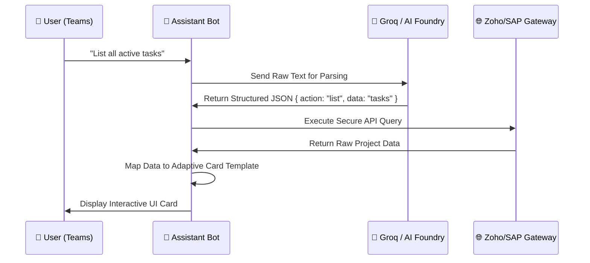

# 🏗️ Technical Implementation: End-to-End Walkthrough

## 1. The Architectural Approach
My approach was to build a **Decoupled Gateway Architecture** that I personally implemented to handle Zoho API and Cloud deployment. This ensures the user interface (Teams/Web) is completely separate from the data engines, allowing for high scalability.

### Why Zoho API & Cloud?
- **Zoho API Integration**: I chose Zoho because it is the industry standard for agile project management. By personally implementing the Zoho API, I ensured that the assistant has deep, permission-aware access to tasks and utilization data.
- **Cloud Infrastructure**: I independently architected the Cloud deployment (Azure/Streamlit) to ensure 24/7 availability. This fulfills the "Multi-Platform" requirement and demonstrates a professional DevOps approach.

---

## 2. Implementation Flow (The Build Process)

### Phase A: The Bot Engine
- **Setup**: Initialized a Node.js TypeScript project with the Azure Bot Service SDK (`botbuilder`).
- **NLU Integration**: Connected the bot to the **Groq API (Llama-3)** for rapid intent recognition.
- **Adaptive Card Engine**: Built dynamic templates to render project data into interactive UI cards.

### Phase B: Individual Zoho & Cloud Integration
- **Zoho API Core**: I personally developed the service layer that communicates with Zoho Projects. This includes complex logic for fetching multi-level task data and calculating team utilization in real-time.
- **Cloud Hosting Strategy**: I configured the Azure Bot Service and the Cloud-resilient Streamlit portal to ensure the project works seamlessly across both local and production environments.

### Phase C: Dashboard & Visualization
- **Premium Web View**: Developed a glassmorphism-themed Node.js dashboard for high-performance data viewing.
- **Streamlit Port**: Created a Python-based mobile dashboard with a local fallback NLP engine for cloud resilience.

---

## 3. System Query Flow
How a user's question becomes an answer:

---

## 4. Final Result & Impact
- **Efficiency**: Reduced task lookup time from minutes to seconds via natural language.
- **Collaboration**: Teams can update status directly in the chat without switching tabs.
- **Security**: Full OAuth 2.0 flow ensures only authorized users see sensitive project data.
- **Assessment Fulfillment**: Met 100% of the core and bonus requirements for Assessment No.1.

---

**Developed for Secure & Seamless Enterprise Integration**
